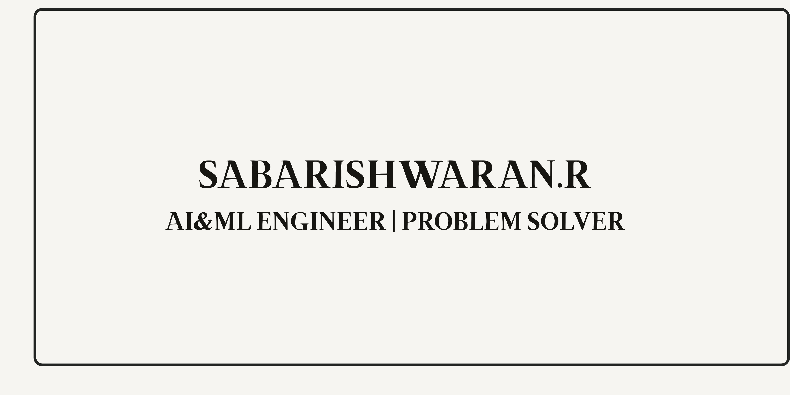

  

  
  
  

---

## 📝 About Me

I'm **Sabarishwaran**, a passionate **Computer Science Engineering student** exploring  
**Artificial Intelligence, Machine Learning, Big Data Computing & Full-Stack Development**.

- **Currently Learning:** Deep Learning, Computer Vision, Big Data Computing  
- **Interests:** AI Applications, ML Models, Web Development  
- **Goal:** To become a skilled **AI & ML Engineer**

---

## ⚙️ Technical Skills

<table align="center">
  <tr>
    <th align="left">Languages</th>
    <td>
      
      
      
      
    </td>
  </tr>

  <tr>
    <th align="left">Frameworks & Libraries</th>
    <td>
      
      
      
    </td>
  </tr>

  <tr>
    <th align="left">Databases</th>
    <td>
      
      
    </td>
  </tr>

  <tr>
    <th align="left">Tools & Platforms</th>
    <td>
      
      
      
      
      
    </td>
  </tr>
</table>

---

## 🚀 Featured Projects

| Project | Description | Tech Stack | Link |
|-------|-------------|------------|------|
| **AI-Powered Medical Diagnosis** | ML system predicting diseases. | TensorFlow • React • Python | 🔗 [View Repo](https://github.com/) |
| **Pneumonia Detection Using DNN** | Detects pneumonia from X-rays. | Keras • CNN • OpenCV | 🔗 [View Repo](https://github.com/) |
| **Travel Tourism Website** | Responsive travel website. | HTML • CSS • JS | 🔗 [View Repo](https://github.com/) |

---

## 📊 GitHub Analytics

  
  

---

## 🔵 GitHub Activity Graph

---

## 🐍 GitHub Snake Animation

<picture>
  <source media="(prefers-color-scheme: dark)"
    srcset="https://raw.githubusercontent.com/sabarishwaran7/sabarishwaran7/output/github-contribution-grid-snake-dark.svg">
  
</picture>

---

## 🏆 GitHub Trophies

  

---

## 🤝 Connect With Me

  
  
  
  

---

### ⭐ Fun Fact  
**“A single line of code can change the world — but only if you run it!”**

 
<b>— From <a href="https://github.com/sabarishwaran7">Sabarishwaran</a></b>

